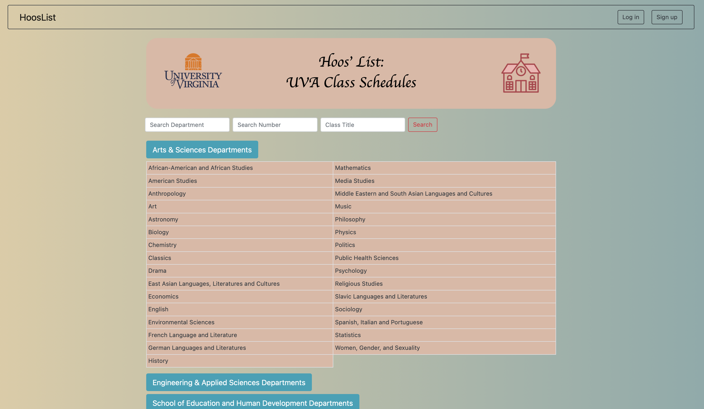
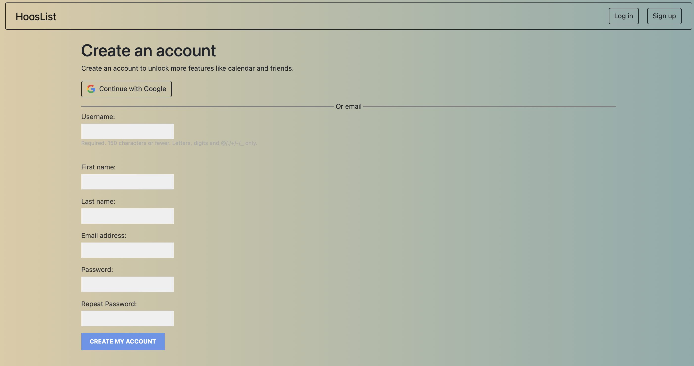
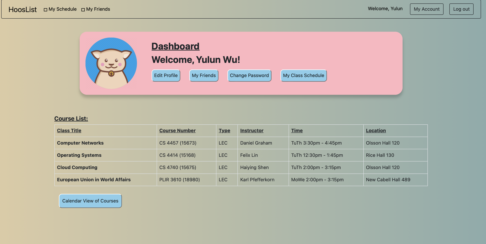

# College Course Display and Scheduling Website
Hoos' list is a stateless website that primarily allows University of Virginia
students to quickly view classes and build schedules. 

## Features
#### Without login, users are able to see all class mnemonics/departments on the landing homepage, and clicking on any one of these will take them to a page that has all classes under the subject. 

#### Without login, users can also search for some certain classes with filters like department, class number,and class title/name. 

#### Other features are only unlocked after account creation and user login. Users can choose to sign up via Google, or traditional username/password combination.

#### Dashboard displays all user information and has tabs that direct to schedule builder and friends list.

### There's an "add to course list" button for each class for each logged-in user. It will add the selected course to a visual timetable-like schedule.

#### The trash icon will delete the corresponding class (along with other sections of the same class!) from the schedule.

#### There's a hover-over effect for each class on the schedule that prompts the user to click on each one, which will then display detailed information in a modal. 

#### The system also prevents time conflicts and prevents signing up for multiple sections of the same course.

#### Logged-in users are able to "friend" other users by searching their username, first name, last name, or their email adress.

#### Each account's "friends" information is separated into 3 categories as follows

#### Once friends, users can see each other's schedule by clicking on their username in the "current friends" column.

## Miscellaneous
 - Currently, the website only supports class search for spring 2023 semester,
but can very easily be adapted to add all other past semester as well.
 - Similarly, more search filters could be added in the future. 
 - Last updated date: Mar 19, 2023. 

